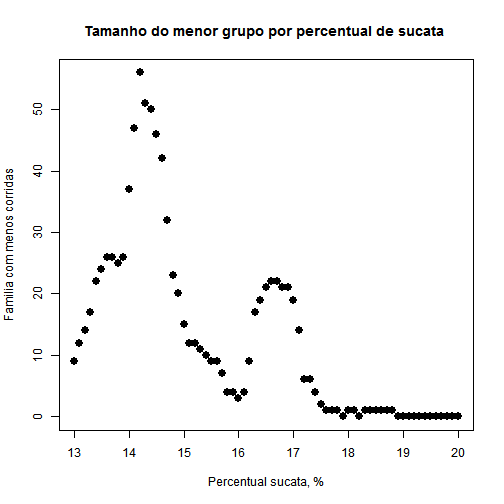

# Análise dos dados de ressopro

O objetivo deste relatório é retratar a análise de dados conduzida para descobrir evidências que levem as causas do suposto aumento no índice de ressopro observado na Aciaria 2.

Foi preparada uma consulta em linguagem SQL para obtenção de dados. Os registros foram exportados para o formato **CSV** (*comma separated values*) para tratamento no software **R**.


```r
rm(list=ls())
setwd("C:/Users/Public/Documents/RDataAnalysis/08_reblow")
rawData <- read.csv("qry_ressopro_global.csv", sep=";")
names(rawData)
```

```
##  [1] "NUM_CORR_ACI"        "TEMPO_INIC_SOPRO_LD" "DT_PRODC_OBTD_ACI"  
##  [4] "GRAU"                "CD_SOP"              "CD_PDR_O2"          
##  [7] "TGUSA"               "MED_TGUSA"           "TP_CORR"            
## [10] "T_1INTER"            "T_2INTER"            "T_FS"               
## [13] "T_VAZAMENTO"         "VOL_RESS"            "PERC_SUCATA"
```

O número de observações é 1774. São 15 colunas com informações das corridas sendo que o campo chave é `NUM_CORR_ACI`.

## Análise do efeito do percentual de sucata

O percentual de sucata ao longo dos meses é apresentado a seguir. Inicialmente foi preciso criar uma coluna para agrupar os meses do ano de 2014. A maior data disponível é 2014-12-16 (no formato YYYY-MM-DD). `rawData` é um `data.frame` e vamos adicionar uma coluna chamada `mes` para conter apenas o número do mês corrente extraido da data (`DT_PRODC_OBTD_ACI`).


```r
rawData$mes <- format(as.Date(rawData$DT_PRODC_OBTD_ACI, format="%d/%m/%Y"), format="%m")
```

O ressopro foi considerado quando o volume de oxigênio soprado foi superior a 40 Nm^3 .


```r
rawData$ressopro <- (rawData$VOL_RESS > 40)
```

A taxa de ressopro mensal pôde, então, ser calculada:


```r
tapply(rawData$ressopro, rawData$mes, sum)/table(rawData$mes)
```

```
##     11     12 
## 0.1951 0.1643
```

Dentro dessas 1774 corridas, temos diferentes siglas (que possuem teores máximos admissíveis de fósforo diferentes) e diferentes percentuais de sucata. Queremos investigar se as taxas de ressopro obtidas em amostras estratificadas seriam consistentemente diferentes. Vamos criar um *bootstrap* a partir do *pool* de corridas em `rawData`. Realizei esta mesma análise no Excel e a conclusão obtida era a de que não havia diferença. Agora, vou criar uma função para fazer o *bootstrapping* automaticamente e conferir se as conclusões se sustentam. Depois, vamos umsar um banco de dados maior porque usando apenas 2 meses (como foi o caso da análise via Excel) estamos tirando o efeito 'aumento do ressopro' pois estamos analisando apenas corridas oriúndas do período de 'alto índice de ressopro'. 

Vamos dar uma olhada no número de corridas por família:

```r
j <- table(rawData$TP_CORR)
```

Em função da quantidade de observações, vamos compor as amostras somente com as famílias em que a contagem for superior a 100 corridas.


```r
incluir <- names(j)[j>100]
sub <- subset(rawData, subset=rawData$TP_CORR %in% incluir)
table(as.character(sub$TP_CORR))
```

```
## 
##        AA S >  6 Duplo refino CAS  Duplo refino LF              UBC 
##              513              139              241              646
```

```r
familias <- c("AA", "DR-CAS", "DR-FP", "UBC")
```

Depois deste procedimento ficamos com um subconjunto dos dados originais chamado `sub` que contém 1539 corridas. O percentual de sucata (variável em estudo) para as corridas do conjunto `sub` é mostrado a seguir:


```r
sub$TP_CORR <- droplevels(sub$TP_CORR)
plot(sub$PERC_SUCATA ~ jitter(as.numeric(sub$TP_CORR)), pch=19, col='red', cex=1.5, xlab="Tipo de aço", ylab="% sucata", xaxt='n')
title("Percentual de sucata por tipo de aço")
axis(side=1, at=c(1, 2, 3, 4), labels=familias)
```

 

Os tipos de aço foram codificados em números usando `as.numeric(sub$TP_CORR)`. Para saber quem é quem foi usado:


```r
table(sub$TP_CORR, as.numeric(sub$TP_CORR))
```

```
##                   
##                      1   2   3   4
##   AA S >  6        513   0   0   0
##   Duplo refino CAS   0 139   0   0
##   Duplo refino LF    0   0 241   0
##   UBC                0   0   0 646
```

O gráfico da distribuição de sucata por tipo de aço mostra que existe uma concentração que cobre todas as famílias ao redor de 14% e 16%. O aço `AA` tem muitas corridas com mais de 23% e, neste caso, é possível fazer uma comparação onde o percentual de sucata tem um range maior entre os agrupamentos, perdendo apenas, a capacidade de avaliar o efeito do tipo de aço.

### Dividindo o conjunto de dados em grupos pelo percentual de sucata

Vamos percorrer o conjunto de dados com janelas de banda fixa (inicialmente 1%) e vamos procurar as bandas que absorvem grande número de corridas transversalmente (entre todas as famílias). Sabemos pelo *jittered plot* que vamos encontrar tais famílias entre 14 e 16% de sucata. O comprimento da banda é importante porque entre 14 e 16% temos 2% de diferença. Se a banda tiver esse mesmo tamanho estaremos mais propensos ao confundimento. Iremos usar, portanto, *non overlapping bands*.

O algorítmo para varredura está resumido nas seguintes tarefas:
* obter um valor médio inicial
* calcular o limite inferior como = valor inicial - (banda/2)
* calcular o limite superior como = valor inicial + (banda/2)
* contar quantos valores de cada família estao incluídos na banda
 

```r
banda <- 1.0  
i <- seq(from=13, to=20, by=0.1)
result <- c()
for(x in i){
  intervalo <- c(x-(banda/2), x+(banda/2))
  temp <- as.numeric(tapply(as.numeric(sub$PERC_SUCATA > intervalo[1] & sub$PERC_SUCATA < intervalo[2]), sub$TP_CORR, sum))
  result <- rbind(result, c(x, temp))
}
rm(x, i, intervalo, temp, j)
```

Para obter uma saída gráfica para as contagens, usamos:


```r
plot  (result[,2]~result[,1], pch=19, col="blue",   cex=1.5, ylab="Contagem", xlab="Meio faixa")
points(result[,3]~result[,1], pch=19, col="red",    cex=1.5)
points(result[,4]~result[,1], pch=19, col="green",  cex=1.5)
points(result[,5]~result[,1], pch=19, col="cyan",   cex=1.5)
title("Contagem de corridas por faixa de sucata")
legend(x=13, y=115, legend=familias, col=c("blue", "red", "green", "cyan"), pch=19, cex=0.5)
```

 

Analisando a saída gráfica, notamos que além de 17% não existem corridas do tipo DR-CAS e DR-FP. As faixas que tem número significativo de exemplos (observações) são 14,2% e 16,6%, conforme pode ser visto na análise abaixo:


```r
lista <- c()
for(i in seq(from=1, to=nrow(result)) ){
  lista <- rbind(lista, c(result[i,1], min(result[i, -1])))
  ## http://mathesaurus.sourceforge.net/octave-r.html
}
rm(i)
plot(lista[,2]~lista[,1], pch=19, col="black", cex=1.5, xlab="Percentual sucata, %", ylab="Familia com menos corridas")
title("Tamanho do menor grupo por percentual de sucata ")
```

 

### Subdividindo o conjunto de dados para os percentuais 'alto' e 'baixo'

Como foi definido nas seções anteriores, os grupos de percentual de sucata com maior contagem transversal no período são 14,2% (*baixo*) e 16,6% (*alto*). A diferença máxima entre os grupos é de 3,4%. Essa diferença pode não ser grande o suficiente para garantir que o efeito da quantidade de sucata seja observável. 

O valor da menor classe para o grupo 16,6% é 22 corridas. Temos um agrupamento com menor classe de tamanho 22 para 13,4% que garantiria uma diferença máxima de 4,2%. Os tamanhos de cada agrupamento para estes percentuais selecionados é mostrado abaixo:


```r
resumo <- data.frame(rbind(result[result[,1]==13.4], result[result[,1]==16.6]))
names(resumo) <- c("perc", familias)
resumo
```

```
##   perc AA DR-CAS DR-FP UBC
## 1 13.4 36     31    22  24
## 2 16.6 29     22    28 110
```

Notamos que a maior diferença está na família UBC que tem 24 corridas com sucata *baixa* e 110 corridas com sucata *alta*.
Podemos usar a reamostragem (*bootstrapping*) para contornar este problema mas antes vamos comparar os grupos sem a família UBC. Para proceguir precisamos subdividir o conjunto de dados para incluir apenas as corridas com os percentuais de sucata dentro das faixas consideradas como os níveis *alto* e *baixo*.


```r
b <- c(13.4-(banda/2), 13.4+(banda/2))
a <- c(16.6-(banda/2), 16.6+(banda/2))
baixa <- subset(sub, subset=sub$PERC_SUCATA > b[1] & sub$PERC_SUCATA < b[2] )
alta  <- subset(sub, subset=sub$PERC_SUCATA > a[1] & sub$PERC_SUCATA < a[2] )
rm(a, b, banda)
```

### Testes preliminares: usando os dados brutos

Para o teste de diferença de proporção, usar: `prop.test`.


```r
na1 <- nrow(alta)
nb1 <- nrow(baixa)
pa1 <- sum(as.numeric(alta$ressopro))
pb1 <- sum(as.numeric(baixa$ressopro))
test1 <- prop.test(x=c(pa1, pb1), n=c(na1, nb1))
print(test1)
```

```
## 
## 	2-sample test for equality of proportions with continuity
## 	correction
## 
## data:  c(pa1, pb1) out of c(na1, nb1)
## X-squared = 3.505, df = 1, p-value = 0.06117
## alternative hypothesis: two.sided
## 95 percent confidence interval:
##  0.001179 0.188361
## sample estimates:
## prop 1 prop 2 
## 0.2275 0.1327
```

O p-valor obtido foi 0.0612 que é marginalmente superior ao nível de significância de 5%. O intervalo de confiança para a diferença foi entre 0.0012 e 0.1884. A conclusão é a de que proporção de ressopro nas corridas com sucata alta (0.2275) é significativamente maior do que a das corridas com sucata baixa (0.1327).

### Testes preliminates: excluindo as corridas UBC

O segundo teste excluiu as corridas UBC devido a diferença no tamanho dos agrupamentos entre sucata alta e sucata baixa.


```r
na2 <- nrow( subset(alta,  alta$TP_CORR != "UBC") )
nb2 <- nrow( subset(baixa, baixa$TP_CORR != "UBC") )
pa2 <- sum(as.numeric(subset(alta,  alta$TP_CORR != "UBC")$ressopro))
pb2 <- sum(as.numeric(subset(baixa, baixa$TP_CORR != "UBC")$ressopro))
test2 <- prop.test(x=c(pa2, pb2), n=c(na2, nb2))
rm(na1, na2, nb1, nb2, pa1, pa2, pb1, pb2)
print(test2)
```

```
## 
## 	2-sample test for equality of proportions with continuity
## 	correction
## 
## data:  c(pa2, pb2) out of c(na2, nb2)
## X-squared = 0.316, df = 1, p-value = 0.574
## alternative hypothesis: two.sided
## 95 percent confidence interval:
##  -0.08323  0.17369
## sample estimates:
## prop 1 prop 2 
## 0.2025 0.1573
```

O segundo teste que não inclui as corridas UBC mostrou que não há diferença entre o ressopro em função do percentual de sucata (p-valor = 0.574). Vamos dar uma olhada na taxa de ressopro por quantidade de sucata extratificada por família de aço:


```r
rbind(
 c("alta",  tapply(alta$ressopro, alta$TP_CORR, sum)/table(alta$TP_CORR)),
 c("baixa", tapply(baixa$ressopro, baixa$TP_CORR, sum)/table(baixa$TP_CORR))
)
```

```
##              AA S >  6           Duplo refino CAS    Duplo refino LF    
## [1,] "alta"  "0.206896551724138" "0.227272727272727" "0.178571428571429"
## [2,] "baixa" "0.138888888888889" "0.129032258064516" "0.227272727272727"
##      UBC                 
## [1,] "0.245454545454545" 
## [2,] "0.0416666666666667"
```

Em todas as famílias exceto DR-FP o ressopro foi superior nas corridas com sucata alta. A maior diferença foi observada na família UBC. De fato, foi esta família responsável pela diferença entre `test1` e `test2`. UBC com sucata alta ressoprou 24% e com sucata baixa ressoprou 4%.

### Teste final com *bootstrapping*

a idéia do *bootstrapping* é criar várias amostras 


