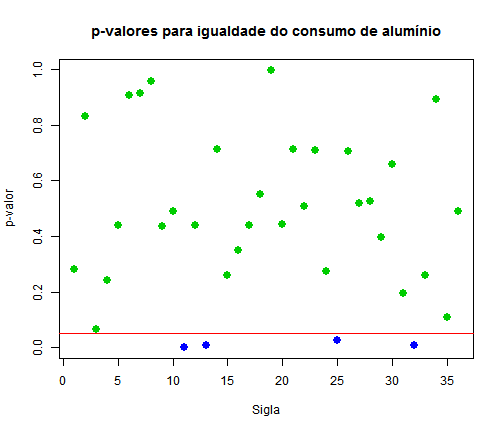
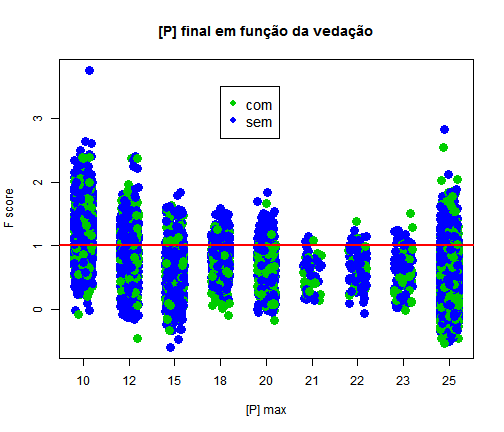
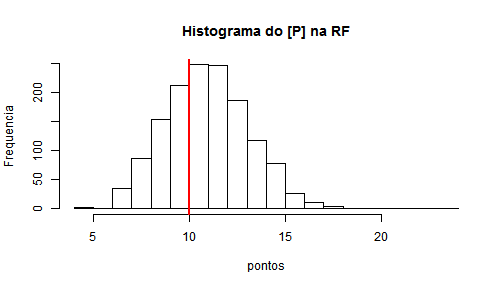

# Efeito metalúrgico da vedação do dardo

Foram obtidos registros do banco de dados de processo para avaliar a diferença no consumo de alumínio e no fósforo final das corridas *com* e *sem* a vedação do dardo refratário. Existem 7 códigos para o funcionamento do dardo. O código 0 significa falta de registro. As corridas com código 0 foram eliminadas do banco. O código 1 indica que o dardo caiu no furo de corrida e vedou. Os códigos de 2 a 6 são problemáticos. Assim, foram considerados dois níveis para o fator `CLS_DARDO`: **com dardo** e **sem dardo**.


```r
rm(list=ls())
setwd("C:/Users/Public/Documents/RDataAnalysis/09_darth")
rawData <- read.csv("dardo.csv", sep=";")
names(rawData)
```

```
## [1] "NUM_CORR_ACI" "SIGLA_ACO"    "COD_TPAO"     "CLS_DARDO"   
## [5] "CONS_AL"      "P"            "P_MAX"
```

A idéia é comparar o consumo de alumínio e o teor final de fósforo para as corridas com e sem o código de funcionamento do dardo. O banco de dados contempla corridas do ano de 2014. O número total de observações é 12917.

Inicialmente, vamos explorar a quantidade de observações com e sem dardo, no período:


```r
table(rawData$CLS_DARDO)
```

```
## 
## com dardo sem dardo 
##      4264      8653
```

O número de corridas sem dardo é muito superior ao número de corridas com vedação.

## Efeito da vedação no consumo de alumínio

Para testar estatisticamente o efeito da vedação, vamos obter amostras aleatórias de corridas com e sem dardo para diferentes siglas de aços (`SIGLA_ACO`). A tabela de contingência abaixo mostra uma tabulação da quantidade de observações por sigla:


```r
tabela <- table(rawData$SIGLA_ACO, rawData$CLS_DARDO)
```

Existem muitas siglas com um numero pequeno de observações. Para reduzir o número de siglas vamos criar um subconjunto dos dados originais para o qual a contagem de observações da mesma sigla nos dois tratamentos (`CLS_DARDO`) seja maior que um limiar arbitrário de 30 corridas. 


```r
siglas <- as.list(dimnames(tabela)[[1]])
indices <- (1:length(siglas))[tabela[,1] > 30 & tabela[,2]>30]
incluir <- as.character(siglas[indices])
subData <- subset(rawData, rawData$SIGLA_ACO %in% incluir)
rm(indices, siglas)
```

O número de siglas que atenderam o critério é 36. O número total de observações no subconjunto (`subData`) é 9385. A tabela de contingência abaixo mostra o conteúdo deste subconjunto:


```r
subData$SIGLA_ACO <- droplevels(subData$SIGLA_ACO)
table(subData$SIGLA_ACO, subData$CLS_DARDO)
```

```
##                     
##                      com dardo sem dardo
##   21Q1AA000100010099        43        82
##   24JDAA000100010099       370       917
##   30Z2AA000200026099        62       120
##   62D2AC0030000260X9        33        81
##   7PMAAS010000135099        40       101
##   81CDAS010000156099        31        53
##   84D1AS000150050099        47        60
##   AAC1AA0040000210X9        34        44
##   AAC2AA0090000460X9        44       116
##   AAC3AA0040000210X9       227       306
##   AACDAA0110001510X9        76       152
##   AACHAA0120000360X9        77       107
##   DCC1AS006000110099        38        66
##   DDC1AA0120000860X9       102       222
##   DDC1AA0130001200X9        35        64
##   DDC1AA0160000360X9        86       186
##   DDC1AA0160000560X9        58       142
##   DDCHAA0090000360X9        57        87
##   DGC2AA003000021099       145       216
##   DGC2AA006000040099        53       109
##   EWZBAA006000120099        47        94
##   FVZ1AA000150064099       130       252
##   GXCHAS016000145099        34        79
##   GXCHAS018000145099        56       123
##   JYCHAS0140000660X9        44        52
##   JYCHAS0160001060X9        66       149
##   LQC1AA006000066099        87       148
##   MBA2AA000150010099       337       931
##   QECDAA0090000360X9        70       112
##   RJZHAS014000130099        41        43
##   TGCDAA008000061099        75       136
##   TNZ2AA000180056099        59       115
##   VJQ1AA000150015099       244       565
##   VNBCAA012000180099        31        33
##   WOMAAS008000150099        82       169
##   YUCBAA009000153099        34        58
```


```r
table(subData$CLS_DARDO)
```

```
## 
## com dardo sem dardo 
##      3095      6290
```

```r
rm(tabela)
```

### Teste de hipóteses

Vamos realizar um teste de hipóteses separado para cada sigla. 


```r
pvalores <- c()
for(indice in 1:length(incluir)) {
  td <- subset(subData, subData$SIGLA_ACO %in% incluir[indice])
  pvalores <- rbind(pvalores, t.test(td$CONS_AL ~ td$CLS_DARDO)$p.value)
  rm(td)
}
rm(indice)
plot(pvalores, pch=19, col=(pvalores<0.05)+3, cex=1.5, ylab="p-valor", xlab="Sigla")
abline(h=0.05, col='red')
title('p-valores para igualdade do consumo de alumínio')
```

 

O gráfico acima mostra o p-valor para as 36 siglas selecionadas. Quando o p-valor é menor que o nível de significância (0,05) a amostra permite rejeitar a hipótese de igualdade entre os tratamentos. Dentre as 36 siglas, apenas 4 apresentaram diferença entre o consumo de alumínio. No gráfico, a linha representa o nível de significância de 5%. Abaixo, estão listadas as siglas onde a diferença foi significativa.


```r
sign <- subset(subData, subData$SIGLA_ACO %in% incluir[(pvalores<0.05)])
sign$SIGLA_ACO <- droplevels(sign$SIGLA_ACO)
table(sign$SIGLA_ACO, sign$CLS_DARDO)
```

```
##                     
##                      com dardo sem dardo
##   AACDAA0110001510X9        76       152
##   DCC1AS006000110099        38        66
##   JYCHAS0140000660X9        44        52
##   TNZ2AA000180056099        59       115
```

```r
rm(sign)
```

## Efeito da vedação no teor de fósforo final

Nesta análise vamos agrupar as observações pelo fósforo máximo. A tabela de contingência abaixo mostra o número de observações para cada valor de fósforo máximo na sigla. Vamos considerar apenas as observações com o fósforo máximo menor ou igual a 25.


```r
table(rawData$P_MAX)
```

```
## 
##   10   12   15   18   20   21   22   23   25   30   35   39   50   55   80 
## 1407  942 1298  539  441   65  111  108 6403  413  393   53  412  191   83 
##   90 
##   58
```

```r
pData <- subset(rawData, rawData$P_MAX <= 25)
table(pData$P_MAX, pData$CLS_DARDO)
```

```
##     
##      com dardo sem dardo
##   10       395      1012
##   12       288       654
##   15       348       950
##   18       169       370
##   20       143       298
##   21        30        35
##   22        35        76
##   23        39        69
##   25      2265      4138
```

Vamos observar graficamente o comportamento do fósforo final em função do funcionamento do dardo. Para analisar as diferentes famílias na mesma base, vamos normalizar o teor de fósforo pelo teor máximo admissível. Para normalizar os valores, será criado um *score* chamado f que vale 1.0 para o fosforo máximo. A fórmula utilizada para o *escore* f é mostrada abaixo:

$$ f=\frac{2 \left( \textrm{obt} - \textrm{min} \right) }{\textrm{max} - \textrm{min}} -1 $$

A aplicação desta forma criou uma coluna adicional chamada `f.score`.


```r
familias <-levels(as.factor(pData$P_MAX))
pData$f.score <- 2*(as.numeric(pData$P)/pData$P_MAX)-1
plot(pData$f.score ~ jitter(as.numeric(as.factor(pData$P_MAX))), pch=19, col=(pData$CLS_DARDO == "sem dardo")+3, cex=1.6, xaxt='n', ylab='F score', xlab='[P] max')
title("[P] final em função da vedação")
axis(side=1, at=1:9, labels=familias)
legend(x=4, y=3.5, legend=c("com", "sem"), col=c(3,4), pch=19, cex=1.2)
abline(h=1.0, col='red', lwd=2)
```

 

O que primeiro chamou atenção foi a quantidade de corridas com o teor de P final maior que o máximo. Vamos fazer um histograma para a família `P_MAX = 10`.


```r
hist(pData$P[pData$P_MAX == "10"], breaks=15, ylab="Frequencia", xlab="pontos", main="Histograma do [P] na RF")
abline(v=10, col='red', lwd=2)
```

 

Realmente a quantidade de corridas com teor de [P] maior que o máximo para a família `P_MAX = 10` é muito grande. As siglas desta família são as seguintes


```r
fam10 <- pData$SIGLA_ACO[pData$P_MAX == "10"]
fam10 <- droplevels(fam10)
table(fam10)
```

```
## fam10
## 24JDAA000100010099 9CJKAS004000140099 9DJKAS004000140099 
##               1287                  2                  1 
## 9EJKAS003500140099 9GJKAS003000120099 9IJKAS003300125099 
##                  2                113                  1 
## 9JJKAS003300140099 
##                  1
```

Podemos ver que das  corridas da família `P_MAX = 10`, são aços UBC.
