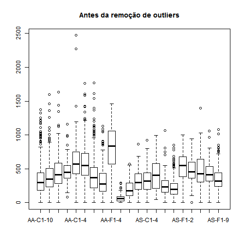
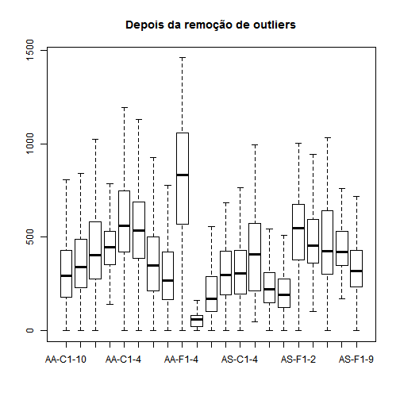
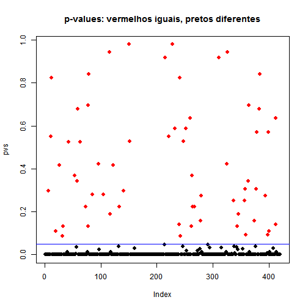
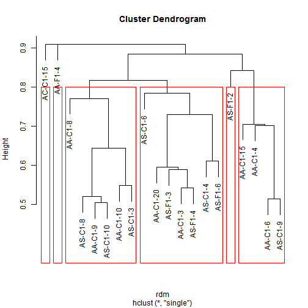
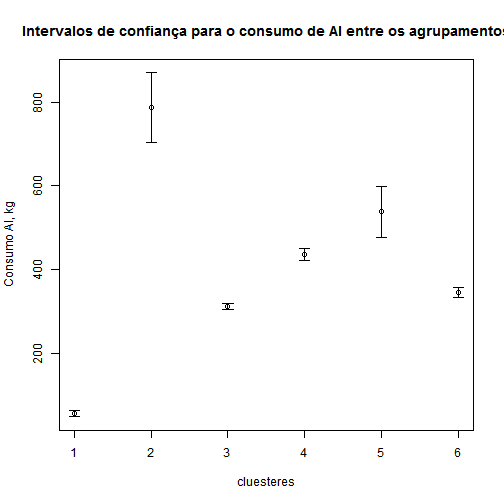

Descoberta não-supervisionada de famílias de consumo de alumínio no CAS-OB
========================================================

# Introdução

A análise da variação do consumo de alumínio nas estações de refino é realizada para descobrir se houve alguma alteraçao no processo em comparação com um período de referência chamado *período de orçamento*. O período de orçamento usado como referência para o ano de 2015 vai do dia 01/set/13 a 31/ago/14.

O objetivo deste trabalho é descobrir de forma não-supervisionada quais seriam as famílias que possuem consumo de alumínio parecido de forma a serem indistintas. Esses agrupamentos (*clusteres*) serão usados para formalizar uma metodologia de determinação de consumo padrão. O consumo padrão do período em relação ao orçamento serve para isolar o efeito do mix de produção das demais variações permitindo descobrir se houve ou não alguma ocorrência que precise ser corrigida. Essa informação serve para prevenir que se inicie uma investigação de um problema que não existe.


# Desenvolvimento

## Sobre o banco de dados utilizado

Foram obtidas 5.704 observações de 9 variáveis do banco espelho do banco de dados de processo da Usiminas. Essas observações referem-se às corridas realizadas no CAS-OB no período do orçamento. As variáveis selecionadas para análise são:


```r
  rm(list=ls())
  setwd("C:/Users/Public/Documents/RDataAnalysis/10_cas_family")
  raw <- read.csv("./03-.csv", sep=';')
  names(raw)
```

```
## [1] "NUM_CORR_ACI"         "COD_LOCAL_EVENTO_ACI" "NUM_TRAT_ACO_PAN"    
## [4] "MES"                  "AL_CAS"               "GRAU"                
## [7] "TRAT"                 "S_MAX"
```

Uma berve descrição destes campos é apresentada a seguir:
* `NUM_CORR_ACI`: Número da corrida, identificador único;
* `COD_LOCAL_EVENTO_ACI` : Indentificador de qual CAS-OB foi utilizado;
* `NUM_TRAT_ACO_PAN`: Número do tratamento. A mesma corrida pode ter mais de um tratamento;
* `MES`: Inteiro longo no formato YYYMM (ano-mês);
* `AL_CAS`: Peso de alumínio usado na corrida;
* `GRAU`: Grau de desoxidação do aço (AA, AC ou AS);
* `TRAT`: Código de tratamento realizado (C1, C7, F1, etc); e
* `S_MAX`: Teor máximo de enxofre da sigla, em pontos;

Os tipos de tratamento obtidos no banco de dados são:

```r
  table(raw$TRAT)
```

```
## 
##   A1   A2   A3   C1   C7   C8   F1   F8 
##   22   10    3 4718   65   53  673  160
```
A tabulação dos teores máximos de enxofre é:

```r
  table(raw$S_MAX)
```

```
## 
##    1    2    3    4    5    6    7    8    9   10   15   20   30 
##   43   95  274  426    8  349    8  874 1163 1421  664  377    2
```
## Pré-tratamento dos dados

A seguir são registradas as etapas de pré-tratamento realizadas. O código apresentado é auto-evidente.

Criaçao de um indicador de família pela concatenação das variáveis que se acredita com base em conhecimento básico do processo mais importam ao consumo de alumínio:

```r
  raw$family <- paste(raw$GRAU, raw$TRAT, raw$S_MAX, sep='-')
  tbl<-table(raw$family)
  names(tbl)
```

```
##  [1] "AA-A1-10" "AA-A1-15" "AA-A1-20" "AA-A1-4"  "AA-A1-8"  "AA-A1-9" 
##  [7] "AA-A2-10" "AA-A2-15" "AA-A2-20" "AA-A2-9"  "AA-A3-10" "AA-A3-15"
## [13] "AA-A3-8"  "AA-C1-10" "AA-C1-15" "AA-C1-20" "AA-C1-3"  "AA-C1-30"
## [19] "AA-C1-4"  "AA-C1-6"  "AA-C1-8"  "AA-C1-9"  "AA-C7-10" "AA-C7-15"
## [25] "AA-C7-20" "AA-C7-6"  "AA-C7-8"  "AA-C7-9"  "AA-C8-20" "AA-C8-3" 
## [31] "AA-C8-4"  "AA-C8-6"  "AA-C8-8"  "AA-C8-9"  "AA-F1-4"  "AA-F1-6" 
## [37] "AA-F8-4"  "AA-F8-6"  "AC-A2-15" "AC-C1-10" "AC-C1-15" "AC-C1-8" 
## [43] "AC-C1-9"  "AC-C7-15" "AS-A1-10" "AS-A1-9"  "AS-A2-9"  "AS-C1-10"
## [49] "AS-C1-20" "AS-C1-3"  "AS-C1-4"  "AS-C1-5"  "AS-C1-6"  "AS-C1-7" 
## [55] "AS-C1-8"  "AS-C1-9"  "AS-C7-10" "AS-C7-3"  "AS-C7-9"  "AS-C8-3" 
## [61] "AS-C8-4"  "AS-C8-6"  "AS-C8-9"  "AS-F1-1"  "AS-F1-10" "AS-F1-2" 
## [67] "AS-F1-3"  "AS-F1-4"  "AS-F1-5"  "AS-F1-6"  "AS-F1-7"  "AS-F1-8" 
## [73] "AS-F1-9"  "AS-F8-1"  "AS-F8-2"  "AS-F8-3"  "AS-F8-4"  "AS-F8-5" 
## [79] "AS-F8-6"  "AS-F8-7"  "AS-F8-9"
```

Foram eliminadas do conjunto de dados todas as famílias cuja frequência no período de orçamento (1 ano) foi menor 50

```r
freq <- as.data.frame(tbl)$Freq
names <- names(tbl)
keep <- names[freq > 50]
sub <- subset(raw, subset=(raw$family %in% keep) )
```

Foi aplicado um altorítmo de remoção de *outliers* que eu implementei baseado no critério de uma vez e meia a distância interquartil:

```r
source("c:/users/public/documents/rdataanalysis/rscripts/removeol.r")

#remove all outliers from each group (wrote this function today)
boxplot(sub$AL_CAS ~ sub$family, main="Antes da remoção de outliers")
```

 

```r
clean <- multilevelrmol(sub, 5, 9)
```

```
## 25  outlier(s) where removed.  4  still remainning 
## 4  outlier(s) where removed.  0  still remainning 
## 11  outlier(s) where removed.  2  still remainning 
## 2  outlier(s) where removed.  0  still remainning 
## 5  outlier(s) where removed.  0  still remainning 
## 5  outlier(s) where removed.  0  still remainning 
## 3  outlier(s) where removed.  0  still remainning 
## 8  outlier(s) where removed.  2  still remainning 
## 2  outlier(s) where removed.  0  still remainning 
## 18  outlier(s) where removed.  2  still remainning 
## 2  outlier(s) where removed.  2  still remainning 
## 2  outlier(s) where removed.  1  still remainning 
## 1  outlier(s) where removed.  0  still remainning 
## 10  outlier(s) where removed.  0  still remainning 
## 5  outlier(s) where removed.  2  still remainning 
## 2  outlier(s) where removed.  0  still remainning 
## 1  outlier(s) where removed.  0  still remainning 
## 1  outlier(s) where removed.  0  still remainning 
## 1  outlier(s) where removed.  1  still remainning 
## 1  outlier(s) where removed.  1  still remainning 
## 1  outlier(s) where removed.  0  still remainning 
## 4  outlier(s) where removed.  0  still remainning 
## 19  outlier(s) where removed.  0  still remainning 
## 1  outlier(s) where removed.  0  still remainning 
## 1  outlier(s) where removed.  0  still remainning 
## 5  outlier(s) where removed.  2  still remainning 
## 2  outlier(s) where removed.  1  still remainning 
## 1  outlier(s) where removed.  0  still remainning 
## 8  outlier(s) where removed.  0  still remainning
```

```r
boxplot(clean$AL_CAS ~ clean$family, main="Depois da remoção de outliers")
```

 

O tamanho do conjunto de dados após a remoção de *outliers* caiu para 5325 com 21 famílias.

## Determinação da semelhança entre as famílias

Para definir o critério de proximidade entre as famílias, foi criada uma matriz com o produto cartesiano do conjunto de famílias com frequência maior que 50 e ele mesmo. Em seguida, foi realizado um teste de hipóteses (*t-test*) entre os pares.


```r
  fam <- names(table(clean$family))
  comb <- expand.grid(fam, fam)
  same <- comb$Var1 == comb$Var2
  comb <- subset(comb, subset=!same)
  pvs <- list();
  for(i in 1:length(comb$Var1))
  {  
    pvs[i] <- t.test(
      x=clean$AL_CAS[clean$family==as.character(comb$Var1[i])], 
      y=clean$AL_CAS[clean$family==as.character(comb$Var2[i])]
      )$p.value
  }
  rm(i)
  comb$pvs <- as.numeric(pvs)
  pvs <- as.numeric(pvs)
  plot(pvs, pch=19, col=(pvs>0.05)+1, cex=1.2)
  abline(h=0.05, col='blue')
  title("p-values: vermelhos iguais, pretos diferentes")  
```

 

A linha azul no gráfico acima é o nível de significância de 5% para o teste t. O número de combinações entre as 21 famílias é 2C21=420.

As combinações de mesma família foram, então, removidas:

```r
  nc<-dim(comb)[1] 
  a <- numeric(nc)
  b <- numeric(nc)
  for(i in 1:21)
  {
    a <- a + i*as.numeric(comb$Var1 == fam[i])
    b <- b + i*as.numeric(comb$Var2 == fam[i])
  }
  comb$a <- a
  comb$b <- b
```

Os *labels* que haviam sido criados para representar unicamente as combinações de famílias (pares do teste-t) foram recodificados e foi criado um indicador de igualdade para os casos em que o p-valor for maior que o nível de significaância.


```r
  label <- list()
  for(i in 1:nc)
  {  
    ordenado<-sort(c(comb$a[i], comb$b[i]))
    label[i] <- paste(ordenado[1], ordenado[2], sep='/')  
  }
  comb$label <- as.character(label)  
  
  comb$a <- NULL
  comb$b <- NULL
  comb$Var1 <- NULL
  comb$Var2 <- NULL
  
  unico <- unique(comb)
  
  #retornar com os rotulos que foram removidos
  a <- list()
  b <- list()
  n <- dim(unico)[1]
  #   ia<-list();ib<-list()
  for(i in 1:n)
  {
    str <- unico$label[i]
    #strsplit(unico$label, '/')
    ## aqui estou perdendo uma familia
    indices <- as.numeric(strsplit(str, '/')[[1]] )
    familias <- fam[indices]
  #     ia[i]<-indices[1]; ib[i]<-indices[2]
    a[i]<-familias[1]
    b[i]<-familias[2]
  }
  unico$a <- as.character(a)
  unico$b <- as.character(b)
  unico$iguais <- (unico$pvs > 0.05)
```

A seguir, foi criado um dendograma baseado na matriz de distância (`mdm`) criada com base na transformação do p-valor do teste.t no formato:

$$
  p'=\frac{1}{1+p}
$$


```r
sample <- subset(unico, select=c('a', 'b', 'pvs'))
library(reshape2)
```

```
## Warning: package 'reshape2' was built under R version 3.1.3
```

```r
#vou normalizar os p-valores para que o dendograma fique mais visivel
  newP <- sample$pvs
  newP <- ifelse(newP < 1e-4, 0.1, newP)
  normP <- (newP - min(newP)/(max(newP)-min(newP)))
  sample$normP <- 1/(normP+1)
  sample$pvs <- NULL

  sample.melt <- melt(sample)
```

```
## Using a, b as id variables
```

```r
  mdm <- acast(sample.melt, a~b, fun.aggregate=sum, drop=FALSE)
  
  mdm <- mdm + t(mdm)
  rdm <- as.dist(mdm)
  hc <- hclust(rdm, method="single")
  plot(hc)

# desenha um retângulo ao redor dos k clusters e armazena os rótulos
  kc=6 # number of clusters
  x<-rect.hclust(hc, k=kc)
```

 

Usando a inspeçao visual do dendograma, foi escolhido o número ideal de *clusteres* como sendo seis. É uma quantidade de famílias adequadas para construção de um relatório de acompanhamento.

Foi realizada análise de variância (ANOVA) para verificar se os *cluesters* são mesmo significativamente diferentes:


```r
    # colocar os rótulos no data.frame <clean>
  cluster <- list()
  for(i in 1:length(fam))
  {
    for(j in 1:kc)
    {
      if( sum( as.numeric( fam[i] == names( x[[j]]))) > 0)
        cluster[i] <- j
    }
  }
  cluster <- as.numeric(cluster)
    
  # Percorrer o data.frame clean e descobrindo qual o cluster de cada famíia 
  n<-dim(clean)[1]
  lcl<-list()
  for(i in 1:n)
  {
    lcl[i]<-cluster[which(clean$family[i] == fam, T)]
  }
  clean$cluster <- as.numeric(lcl)
    
  #fazer uma anova entre os clusteres
  lm<-lm(clean$AL_CAS ~ clean$cluster)
  anova.obj<-anova(lm)
  anova.obj
```

```
## Analysis of Variance Table
## 
## Response: clean$AL_CAS
##                 Df    Sum Sq Mean Sq F value    Pr(>F)    
## clean$cluster    1   2325066 2325066  50.961 1.079e-12 ***
## Residuals     4944 225565311   45624                      
## ---
## Signif. codes:  0 '***' 0.001 '**' 0.01 '*' 0.05 '.' 0.1 ' ' 1
```

O resultado da ANOVA atesta que os agrupamentos não são os mesmos mas isso nao garante que sejam iguais dois a dois. Assim, foi feito novo teste-t, desta vez entre os *cluesteres* e o resultado pode ser observado pela saída gráfica. Para isto, foi criada a função `margin` (abaixo) para retornar o tamaho do intervalo de confiança usando a distribuiçao t de *Student*.


```r
  # o p-value foi zero. Assim, vamos fazer um interval plot, igual aquela
  
  # essa funçao retorna o E para construçao de intervalo de confiança usando a distribuiçao t de student  autor: eu em 25/05/2015 às 13h45
  margin <-function(x, conf=0.95)
  {
    n <- length(x)
    t_half_alpha <- qt(p=(conf+(1-conf)/2), df=n-1)
    return(t_half_alpha*sd(x)/sqrt(n))
  }
```

A saída gráfica do teste-t entre as famílias é apresentado pelo *interval plot* abaixo:


```r
  al_cas <- list()
  margens <- list()
  medias <- list()
  inferior <- list()
  superior <- list()
  for(i in 1:6)
  {
    al_cas[[i]] <- as.numeric( subset( clean, subset=clean$cluster==i, select='AL_CAS')$AL_CAS)
    margens[[i]] <- margin( al_cas[[i]] )
    medias[[i]] <- mean( al_cas[[i]])
    inferior[[i]] <- medias[[i]]-margens[[i]]
    superior[[i]] <- medias[[i]]+margens[[i]]
  }
  
  # saida grafica do Minitab
  library(plotrix)
```

```
## Warning: package 'plotrix' was built under R version 3.1.3
```

```r
  plotCI(x=1:6, 
         y=as.numeric(medias),
         ui=as.numeric(superior), 
         li=as.numeric(inferior),
         xlab='cluesteres', ylab='Consumo Al, kg') 
  title("Intervalos de confiança para o consumo de Al entre os agrupamentos")
```

 
# Conclusões

Foi possível obter um agrupamento de tamanho 6 para famílias de aços com base no grau de desoxidação, tipo de tratamento e enxofre máximo que tem consumo de alumínio indistinto dentro do grupo e diferente entre os grupos. Esses agrupamentos serão usados para criar um padrão de consumo consistente na análise de consumo de alumínio num mês.

Os seis agrupamentos obtidos são os seguintes:


```r
  for(i in 1:6)
  {
    cat(sprintf(" Famílias pertencentes ao cluster %d\n", i))
    print(fam[cluster==i])
    cat(sprintf("\n"))
  }
```

```
##  Famílias pertencentes ao cluster 1
## [1] "AC-C1-15"
## 
##  Famílias pertencentes ao cluster 2
## [1] "AA-F1-4"
## 
##  Famílias pertencentes ao cluster 3
## [1] "AA-C1-10" "AA-C1-8"  "AA-C1-9"  "AS-C1-10" "AS-C1-3"  "AS-C1-8" 
## [7] "AS-F1-9" 
## 
##  Famílias pertencentes ao cluster 4
## [1] "AA-C1-20" "AA-C1-3"  "AS-C1-4"  "AS-C1-6"  "AS-F1-3"  "AS-F1-4" 
## [7] "AS-F1-6" 
## 
##  Famílias pertencentes ao cluster 5
## [1] "AS-F1-2"
## 
##  Famílias pertencentes ao cluster 6
## [1] "AA-C1-15" "AA-C1-4"  "AA-C1-6"  "AS-C1-9"
```
